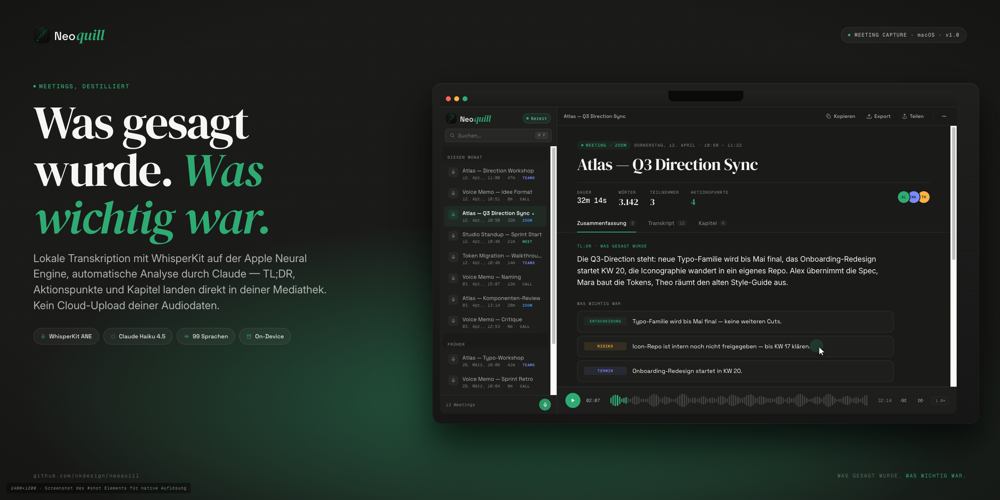

<div align="center">



# NeoQuill

### Was gesagt wurde. *Was wichtig war.*

Local-first meeting intelligence for macOS.
WhisperKit on the Apple Neural Engine for transcription, your configured AI
provider for analysis — TL;DR, action items and chapters land in your library in seconds.
No cloud upload of your audio.

[**⬇ Download Installer (.dmg)**](https://github.com/NKDesign30/NeoQuill/releases/latest) ·
[Changelog](CHANGELOG.md) ·
[Architecture](#architecture) ·
[License](LICENSE)

[](https://github.com/NKDesign30/NeoQuill/releases/latest)
[](https://swift.org)
[](https://github.com/NKDesign30/NeoQuill/releases/latest)
[](https://sparkle-project.org)
[](LICENSE)

</div>

---

## Why NeoQuill

Meeting bots are loud. They sit in your calls, show their face to your customer,
upload everything to a server you do not control and ask you for a subscription
to read what you already said.

NeoQuill does the opposite:

- 🎙️ **Records on your Mac** — microphone plus system audio via Core Audio Tap.
  No second participant in the call.
- 🧠 **Transcribes locally** with WhisperKit on Apple Neural Engine.
  No upload required.
- 👥 **Remembers speakers across meetings** — manual relabels propagate to
  transcript, summary, highlights, tasks and chapters.
- 📥 **Imports official transcripts** from Teams, Google Meet and Zoom when
  you do want to use them.
- 🔑 **Brings your own AI key.** Summaries run against any OpenAI-compatible
  endpoint you configure. Keys live in your Keychain.
- 🛡️ **Diagnostics stay redacted.** When you need support, only metadata and
  sanitized timing data leaves your machine.

## Made for

- **Freelancers and small agencies** documenting customer calls.
- **Consultants, PMs and sales people** who want usable notes without making
  the call feel like a deposition.
- **Privacy-sensitive teams** that need local storage and bring-your-own AI
  keys instead of yet another SaaS contract.

## What Works Now

- macOS app bundle with embedded version, build, commit, branch, dirty-state
  and build date — every build is reproducible and traceable.
- Microphone + system-audio capture (CoreAudio Process Tap, ScreenCaptureKit
  fallback).
- Local meeting storage with SQLite WAL.
- Local transcription through WhisperKit on Apple Neural Engine.
- Speaker diarization with cross-meeting speaker identity memory.
- Manual speaker relabel that propagates to transcript, summary, highlights,
  tasks and chapters in one move.
- Ambiguous speaker-match rejection so labels never confidently lie to you.
- Playback correction for too-short or pitched recordings via rendered WAV
  copies.
- Teams, Google Meet and Zoom transcript import/parsing.
- OpenAI-compatible, Anthropic, Ollama and Claude CLI summary providers;
  secrets stored in the macOS Keychain.
- Privacy-safe diagnostics export.
- Reproducible release packaging with changelog gate, SHA256 and JSON
  manifest.
- Developer ID Application signing + Apple notarization in the release
  pipeline.
- Sparkle 2 auto-updater wired in (EdDSA-verified update feed).

## What Is Still in Progress

- Payment + license layer (NeoQuill is currently free-as-in-still-a-beta).
- Outside-user beta testing on real meetings beyond the developer's setup.

Run the gate before treating any build as ready to ship:

```bash
./scripts/market-readiness.sh
```

## Architecture

```text
SwiftUI App
  ├─ Recording UI · Detail UI · Settings
  ├─ RecordingController
  │   ├─ AudioCapture
  │   ├─ ProcessAudioTap
  │   ├─ SCKAudioCapture fallback
  │   └─ AudioWriter
  ├─ FinalSTTTranscriber · WhisperKit
  ├─ SpeakerDiarizer · SpeakerStore
  ├─ TranscriptMerger · Platform parsers
  ├─ PostProcessor · Summary providers
  ├─ MeetingStore · SQLite (WAL)
  └─ Export · Diagnostics · Action services · AutoUpdater (Sparkle)
```

Core rule: local meeting data stays local unless you explicitly configure an
external provider or connector.

## Stack

| Layer | Choice |
|---|---|
| UI | SwiftUI |
| Build | Swift Package Manager |
| Min OS | macOS 15+ |
| Speech | [WhisperKit](https://github.com/argmaxinc/WhisperKit) (on-device, Apple Neural Engine) |
| Diarization | [FluidAudio](https://github.com/FluidInference/FluidAudio) |
| Audio capture | AVFoundation · CoreAudio Process Tap · ScreenCaptureKit |
| Storage | SQLite (WAL mode) |
| Updates | [Sparkle 2](https://sparkle-project.org) with EdDSA-signed appcast |
| Distribution | GitHub Releases — Developer ID signed + Apple notarized DMG, ZIP fallback |

## Development

```bash
swift build
swift test
```

Run from SPM:

```bash
swift run NeoQuill
```

Build, install and launch the app:

```bash
./scripts/build-app.sh
```

Build without installing:

```bash
./scripts/build-app.sh --no-install --no-run
```

## Release Flow

Work happens on `dev`. `main` is only updated after the release gate passes.

```bash
./scripts/verify-changelog.sh
swift test
./scripts/build-app.sh --no-install --no-run
./scripts/package-release.sh --launch-smoke
```

For public Direct-Sale distribution:

```bash
NEOQUILL_NOTARY_PROFILE=<profile> ./scripts/package-release.sh --strict-distribution --notarize
./scripts/build-dmg.sh --notarize
./scripts/publish-update.sh
./scripts/market-readiness.sh
```

`build-dmg.sh` packages the signed release `.app` into a branded, signed and
notarized DMG installer (drag-to-Applications layout, retina background,
github.com/NKDesign30/NeoQuill footer).

`publish-update.sh` uses the latest manifest as source of truth, requires a
clean tracked worktree plus matching DMG, ZIP and SHA256 sidecars, generates and
signs the Sparkle appcast, commits it on `main` and creates the matching GitHub
Release. Use `--dry-run` for previews or `--skip-push` for a local appcast
commit without touching GitHub.

Release artifacts are written to `dist/`:

- `NeoQuill-v<version>-build<build>-<commit>.dmg` — branded installer, primary download
- `NeoQuill-v<version>-build<build>-<commit>.zip` — legacy / scripted fallback
- matching `.sha256` for each archive
- matching `.json` manifest

## Repository Map

```
Sources/NeoQuill        app source
Tests/NeoQuillTests     regression tests
scripts/                build · package · publish · verify · market gates
docs/decisions/         architecture and product decisions
docs/internal/          in-progress product, speaker-ID and research notes
docs/assets/            README images
Tools/NeonJiraMCP/      MCP connector for meeting → Jira issue drafts
appcast.xml             Sparkle update feed (generated by publish-update.sh)
VERSION                 source of truth for the app version
CHANGELOG.md            human release history
LICENSE                 proprietary license, all rights reserved
```

## Design Notes

NeoQuill belongs to the Neon family and uses the Emerald identity (`#2EAB73`).
The product should feel like a focused Mac utility, not a SaaS dashboard:
fast capture, clear transcript, useful summary, explicit actions.

## Open-Source Inspiration

- [WhisperKit](https://github.com/argmaxinc/WhisperKit) for on-device speech AI.
- [AudioCap](https://github.com/insidegui/AudioCap) for Core Audio Tap reference
  work.
- [muesli](https://github.com/pHequals7/muesli) for pure-Swift local meeting
  transcription ideas.
- [HushScribe](https://github.com/drcursor/HushScribe) for local meeting
  transcription positioning.
- [Sparkle](https://sparkle-project.org) — the de-facto Mac auto-update
  framework.

## License

NeoQuill is **proprietary software** — Copyright © 2026 Niko Knez. All rights
reserved. See [LICENSE](LICENSE) for full terms.

The source is published for transparency, security review and trust-building.
Reading the code, filing issues and submitting pull requests is welcome.
Compiling, redistributing or building derivative products requires written
permission. Official binaries are distributed via the
[Releases](https://github.com/NKDesign30/NeoQuill/releases) page under a
separate end-user license agreement bundled with the app.

For commercial licensing or partnerships: **info@design-nk.de**

---

<div align="center">

Made by [Niko Knez](https://github.com/nikok30) · part of the Neon family.

</div>
